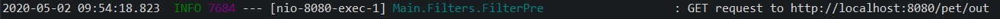
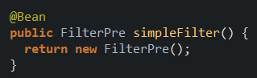

# spring-routing-filtering
Example of spring routing and filtering using spring-cloud-starter-netflix-zuul

<h2> Example of route filtering using spring-cloud-starter-netflix-zuul </h2>

Dependencies:
<ul>
<li>spring-cloud-starter-netflix-zuul</li>
</ul>

<h4>In this case, a rest RoutingFilteringExample microservice is created that provides two endpoints:</h4>
<ul>
<li> localhost: 8080 / in </li>
<li> localhost: 8080 / out </li>
</ul>

 In addition, a <b>GatewayServiceZuul</b> gateway is created to filter the routes of the rest service, in this service a <b>FilterPre</b> filter is created that runs before consuming any of the endpoints in <b>RoutingFilteringExample</b> microservice

obtaining as a result a console log message with the characteristics of the executed request

 For the <b>GatewayServiceZuul</b> to function as a reverse proxy it is necessary to add the <b>@EnableZuulProxy</b> annotation and inject a bean of the <b>FilterPre</b> class 

